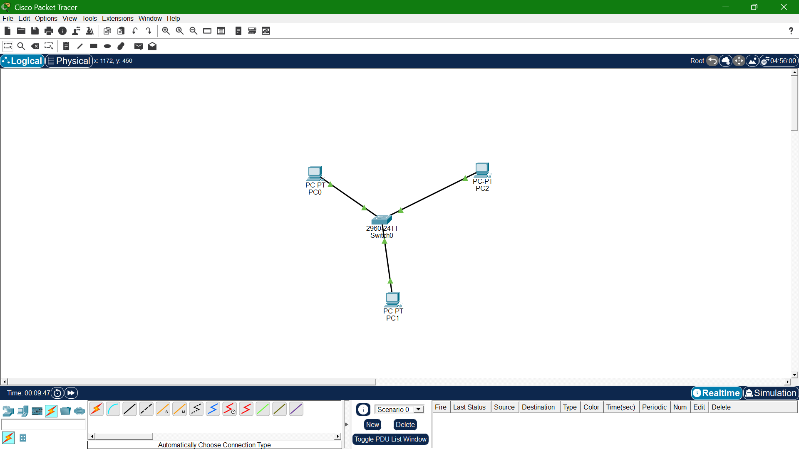

# Lab 01: Basic Connectivity (Star Topology)

## Goal
Build a 3-PC + 1-switch star topology, assign IPs, verify connectivity via ping,
and inspect switch MAC learning behavior.

## Topology

## What I learned
- How switches learn MAC addresses and build their MAC table
- Straight-through cabling for PC-to-switch connections
- Why star topology isolates failures to a single device