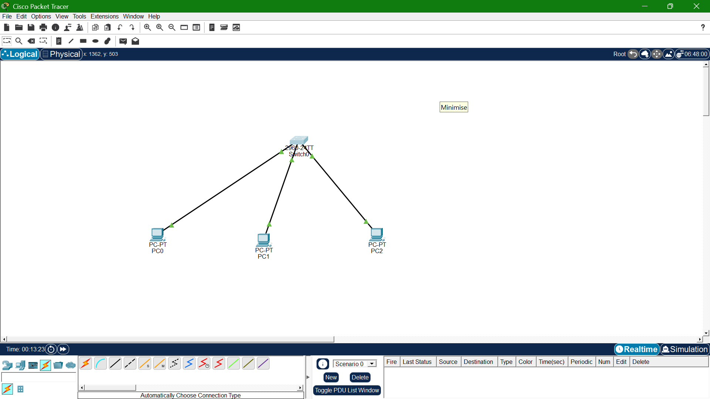

# Lab 02: VLANs

## Goal
Segment a single switch into two VLANs and demonstrate that same-subnet 
devices in different VLANs cannot communicate without a router.

## Topology

## What I learned
- VLANs create separate broadcast domains regardless of IP subnet
- `switchport access vlan X` assigns a port to a VLAN
- Same-subnet devices in different VLANs cannot ping each other — proof 
  that VLAN isolation happens at Layer 2, independent of Layer 3 addressing