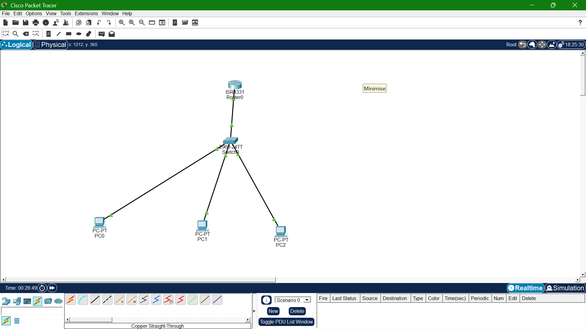

# Lab 03: Inter-VLAN Routing (Router-on-a-Stick)

## Goal
Restore connectivity between VLAN 10 and VLAN 20 using a router with 
802.1Q sub-interfaces, while properly subnetting each VLAN with VLSM.

## Topology

## What I learned
- Router-on-a-Stick uses one physical interface split into VLAN-specific 
  sub-interfaces via 802.1Q encapsulation
- Each sub-interface's IP becomes that VLAN's default gateway
- The switch port facing the router must be a trunk, not access
- Traced the actual routed path with tracert to confirm traffic hits 
  the gateway before reaching the other VLAN