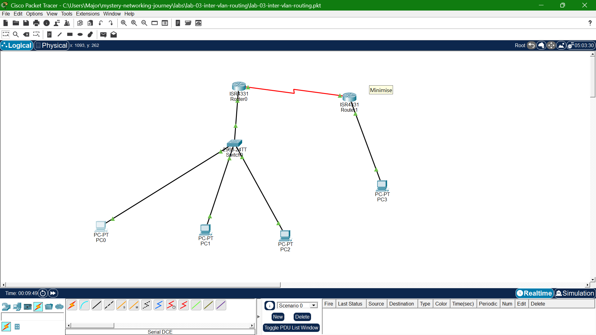

# Lab 04: Static Routing

## Goal
Connect two separate routers over a simulated WAN (serial) link, and use 
static routes to enable full connectivity between all subnets across both sites.

## Topology

## What I learned
- Configured a /30 point-to-point subnet for a router-to-router serial link
- DCE side requires `clock rate`; both sides need `no shutdown`
- Static routes must be configured on BOTH routers, in both directions, 
  since routers don't automatically know about networks they're not 
  directly connected to
- Removed a static route intentionally and watched connectivity break — 
  confirmed static routing does not self-heal or adapt to changes
- Verified multi-hop routing end-to-end using tracert