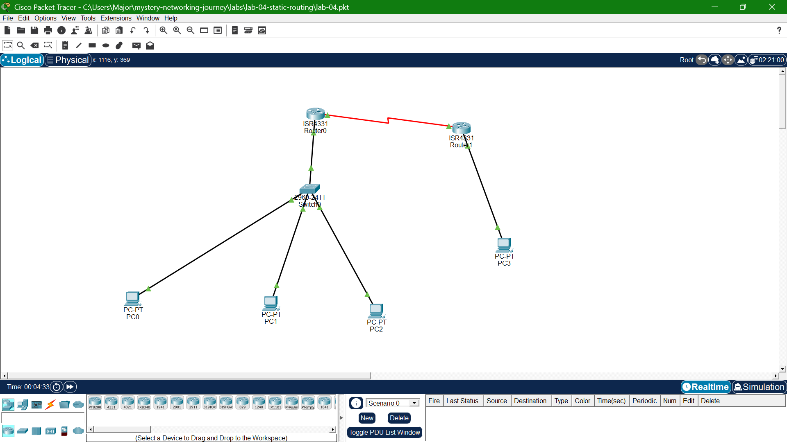

# Lab 05: OSPF (Dynamic Routing)

## Goal
Replace Lab 04's static routes with OSPF, so R1 and R2 automatically 
discover and advertise each other's networks, and self-heal after a 
simulated link failure.

## Topology

## What I learned
- Configured single-area OSPF (Area 0) on both routers
- Used wildcard masks (inverse of subnet masks) in the `network` command
- Verified neighbor formation with `show ip ospf neighbor` (state: FULL)
- Confirmed OSPF-learned routes appear in the routing table marked "O"
- Simulated a WAN link failure and watched OSPF automatically 
  re-converge and restore routes once the link came back — no manual 
  intervention needed, unlike static routing in Lab 04