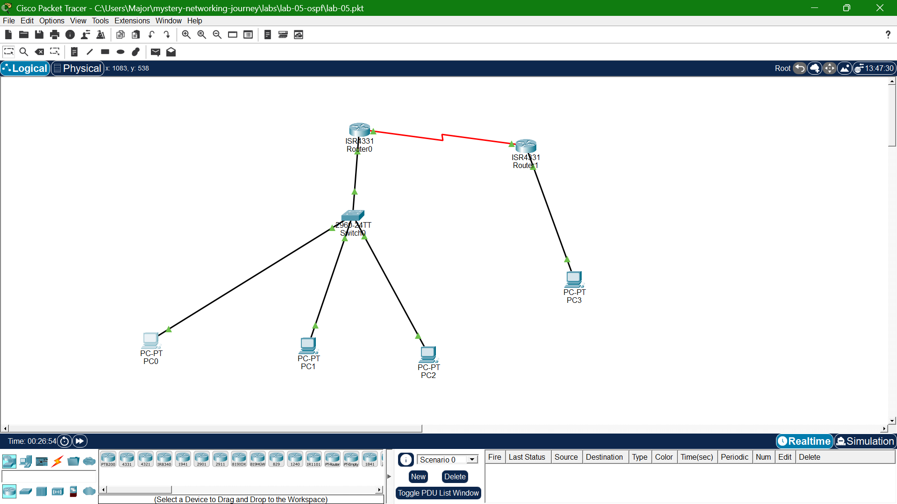

# Lab 06: ACLs

## Goal
Restrict specific traffic between VLANs/subnets using a standard ACL 
(source-only filtering) and an extended ACL (source, destination, and 
port-specific filtering), and demonstrate the implicit deny rule.

## Topology

## What I learned
- Standard ACLs filter by source only and are best placed close to the 
  destination; extended ACLs filter by source/destination/port and are 
  best placed close to the source
- ACL rules are processed top-down, first match wins — rule order matters
- Every ACL has an implicit deny at the end — removing an explicit 
  "permit any" broke connectivity that was never meant to be blocked, 
  proving this rule in practice
- Used `show access-lists` match counters to verify which rules were 
  actually being hit by test traffic